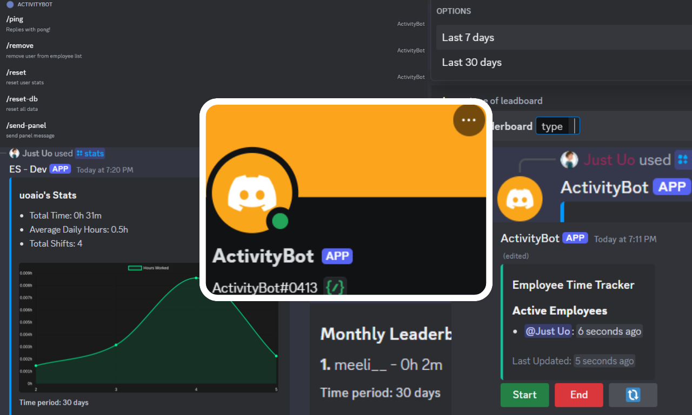

# Employee Time Tracker Discord Bot

The Employee Time Tracker Discord Bot is a powerful tool designed to help server administrators track and manage employee work hours efficiently within Discord.



---

Note: `below text is generated by AI` 

This bot provides a comprehensive solution for time tracking, offering features such as automated role management, detailed statistics, and customizable leaderboards. By leveraging Discord's slash commands and MongoDB for data storage, the bot ensures a seamless and user-friendly experience for both administrators and employees.

Key features of the Employee Time Tracker Discord Bot include:

- Automated tracking of employee work hours
- Role-based management for employees and on-job status
- Customizable leaderboards for weekly and monthly performance
- Detailed individual employee statistics with graphical representations
- Easy-to-use slash commands for all functionalities

The bot is built with scalability and flexibility in mind, making it suitable for Discord servers of various sizes and industries.

## Repository Structure

```
.
├── config.js
├── index.js
├── jsconfig.json
├── package.json
├── README.md
└── text.json
```

### Key Files:

- `index.js`: The main entry point of the application, containing the core bot logic and command implementations.
- `config.js`: Configuration file for storing environment variables such as bot token and MongoDB URI.
- `package.json`: Defines the project dependencies and scripts.

## Usage Instructions

### Installation

1. Ensure you have Node.js version 14.0.0 or higher installed.
2. Clone the repository:
   ```
   git clone <repository-url>
   cd employee-time-tracker-discord-bot
   ```
3. Install dependencies:
   ```
   npm install
   ```
4. Set up environment variables:
   - Create a `.env` file in the root directory
   - Add the following variables:
     ```
     BOT_TOKEN=your_discord_bot_token
     MONGODB_URI=your_mongodb_connection_string
     ```

### Configuration

1. Obtain a Discord bot token from the [Discord Developer Portal](https://discord.com/developers/applications).
2. Set up a MongoDB database and obtain the connection string.
3. Update the `.env` file with your bot token and MongoDB URI.

### Running the Bot

To start the bot, run the following command:

```
node index.js
```

### Bot Commands

The bot provides the following slash commands:

1. `/ping`: A simple command to check if the bot is responsive.
2. `/set employee role`: Set the role for employees (Admin only).
3. `/set on_job role`: Set the role for on-job employees (Admin only).
4. `/send-panel`: Send the leaderboard panel to a channel (Admin only).
5. `/leaderboard`: Display the leaderboard for the last 7 or 30 days.
6. `/stats`: Show statistics for a specific user.

### Integration

To integrate the bot into your Discord server:

1. Invite the bot to your server using the OAuth2 URL generated in the Discord Developer Portal.
2. Ensure the bot has the necessary permissions (Manage Roles, Send Messages, etc.).
3. Use the `/set` commands to configure employee and on-job roles.
4. Use the `/send-panel` command to set up the leaderboard in a desired channel.

### Testing & Quality

To ensure the bot is functioning correctly:

1. Run the `/ping` command to verify the bot's responsiveness.
2. Set up test roles and use the `/set` commands to configure them.
3. Add test users with the configured roles and monitor their time tracking.
4. Use the `/leaderboard` and `/stats` commands to verify data accuracy.

### Troubleshooting

Common issues and solutions:

1. Bot not responding to commands:
   - Ensure the bot token in the `.env` file is correct.
   - Check if the bot has the necessary permissions in the server.
   - Verify that the bot is online and connected to Discord.

2. Database connection issues:
   - Double-check the MongoDB URI in the `.env` file.
   - Ensure your IP address is whitelisted in the MongoDB Atlas settings.
   - Check for any network connectivity issues.

3. Leaderboard not updating:
   - Verify that the correct channel ID is set for the leaderboard.
   - Ensure the bot has permission to edit messages in the leaderboard channel.
   - Check the MongoDB connection for any issues with data retrieval.

For debugging:

- Enable debug mode by setting `DEBUG=true` in the `.env` file.
- Check the console output for any error messages or warnings.
- Review the MongoDB logs for any database-related issues.

## Data Flow

The Employee Time Tracker Discord Bot manages data flow through several key components:

1. User Interaction: Users interact with the bot through Discord slash commands.
2. Command Handling: The bot processes these commands in the `index.js` file.
3. Database Operations: User data and settings are stored and retrieved from MongoDB.
4. Role Management: The bot updates user roles based on their work status.
5. Statistics Generation: The bot calculates and presents user statistics and leaderboards.

```
[User] -> [Discord Interface] -> [Bot Command Handler]
                                       |
                                       v
[MongoDB] <-> [Data Processing] <-> [Role Manager]
                     |
                     v
[Statistics Generator] -> [Discord Interface] -> [User]
```

Note: Ensure proper error handling and data validation at each step of the flow to maintain data integrity and bot reliability.

## Infrastructure

The Employee Time Tracker Discord Bot relies on the following infrastructure components:

### Discord Bot
- Type: Discord Application
- Purpose: Provides the interface for users to interact with the time tracking system

### MongoDB Database
- Type: NoSQL Database
- Purpose: Stores employee data, server settings, and time tracking information

### Node.js Runtime
- Type: JavaScript Runtime
- Purpose: Executes the bot's code and handles server-side logic

### NPM Packages
- discord.js: Interacts with the Discord API
- mongoose: Provides an interface for MongoDB operations
- dotenv: Manages environment variables
- quickchart-js: Generates charts for statistical displays

Ensure all components are properly configured and maintained for optimal bot performance.